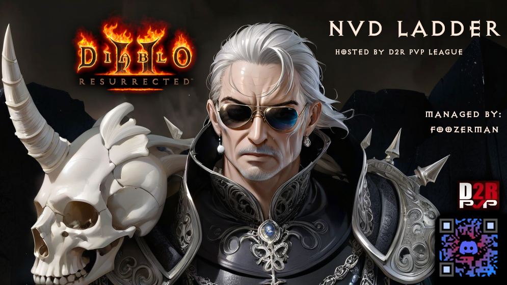

# NvD-Bot



NvD-Bot is a Discord bot for managing PvP duel leaderboards in the "NvD" (Necromancer vs Druid) community, using Google Sheets as its database.

## Features

- **Leaderboard System**: View and challenge others on the leaderboard.
- **Game Management**: Register for events and report match outcomes.
- **Role-Based Commands**: Commands are restricted based on assigned roles.

## Prerequisites

- Node.js (latest LTS version)
- Google Cloud project with Google Sheets API access
- Discord bot token

## Project Structure

```
NvD-Bot/
|-- commands/                 # Command files (nvd-challenge, nvd-leaderboard, etc.)
|-- config/                   # Google Sheets API credentials
|-- handlers/                 # Command handler logic
|-- .gitignore                # Ignoring sensitive/unnecessary files
|-- clear-commands.js         # Clear registered bot commands
|-- deploy-commands.js        # Deploy commands to Discord
|-- index.js                  # Main bot entry point
|-- logger.js                 # Logging module
|-- package.json              # Project dependencies and scripts
|-- README.md                 # Project documentation
```

## Setup

1. **Clone the Repository**
   ```sh
   git clone https://github.com/yourusername/NvD-Bot.git
   cd NvD-Bot
   ```
2. **Install Dependencies**
   ```sh
   npm install
   ```
3. **Environment Variables** Create a `.env` file in the root directory:
   ```
   BOT_TOKEN=your_nvd_bot_token
   CLIENT_ID=your_nvd_bot_client_id
   SPREADSHEET_ID=your_new_nvd_spreadsheet_id
   TEST_GUILD_ID=your_test_server_id
   LIVE_GUILD_ID=your_live_server_id
   REDIS_HOST=localhost
   REDIS_PORT=6379
   REDIS_PASSWORD=your_redis_password
   ```
4. **Google Sheets API**
   - Obtain `credentials.json` from Google Cloud Console and place it in `config/`.
   - Share the Google Sheet with the client email.

## Running the Bot

- **Start the Bot**
  ```sh
  node index.js
  ```
- **Deploy Commands**
  ```sh
  node deploy-commands.js
  ```

## Commands

- `/nvd-challenge` - Initiate a challenge.
- `/nvd-currentchallenges` - Display ongoing challenges.
- `/nvd-leaderboard` - Show leaderboard.
- `/nvd-nullchallenge` - Nullify a challenge (moderators only).
- `/nvd-register` - Register to the leaderboard.
- `/nvd-reportwin` - Report duel results.

## Roles

- **@NvD** - Required for most commands.
- **@NvD Admin** - Required for moderator commands.

## Contribution

- Fork the repository, create a new branch, and submit a pull request.

## License

This project is licensed under the MIT License. See `LICENSE` for details. GG.